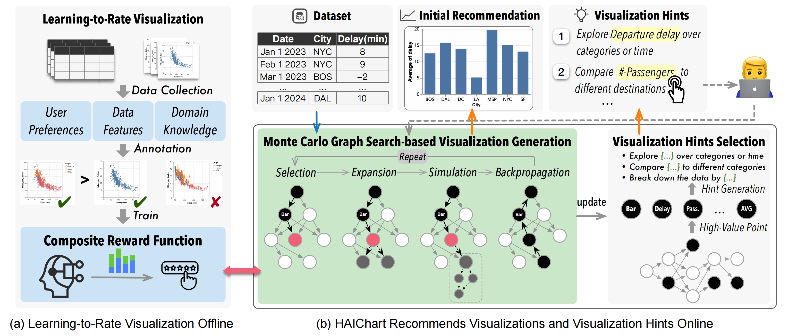
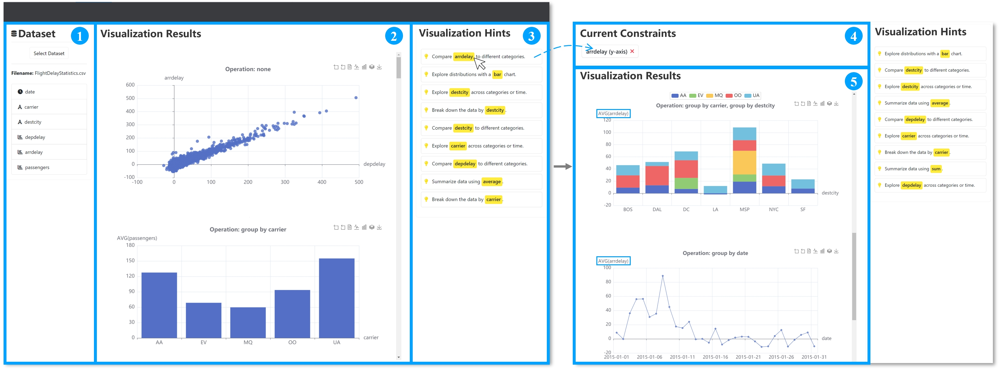

# HAIChart



## Overview

**HAIChart** combines human insights and AI capabilities through reinforcement learning to enhance data visualization processes. This innovative system supports users with high-quality visualization recommendations and hints for interactive exploration, leveraging a two-part framework: the offline learning-to-rate component and the online multi-round recommendations.

- **Offline Learning**: Focuses on understanding and rating visualizations by training a neural network on a vast dataset of visualizations with their ratings.
- **Online Recommendations**: Uses a Monte Carlo Graph Search (MCGS)-powered agent to offer promising visualizations and hints, encouraging exploratory user interaction.

## File Structure
- `datasets` contains the datasets used in this project, including VizML and KaggleBench.
- `static` houses web resources used by the project.
- `templates` includes the source code for the frontend interaction interface.
- `tools` folder contains components that organize this project, such as `features.py`, `instance.py`, etc.
- `user_model` folder holds the implementation code for the user model, including `discriminator.py`, `agent.py`, and more.
- `mcgs.py` is the implementation code for visualization generation and recommendation based on Monte Carlo Graph Search.

## Environment Setup
To set up the environment for HAIChart, ensure you have Anaconda installed and then follow these steps:

1. **Create and activate a new environment:**
```
conda create -n haichart python=3.6.13
conda activate haichart
```

2. **Install the necessary packages:**
```
pip install -r requirements.txt
```

## Demo Running Example

After setting up your environment, you can start exploring HAIChart with a basic demo. This example will guide you through the process of interacting with hints, selecting user constraints, and viewing recommended visualizations.

1. **Start the HAIChart server:**
```
python haichart.py
```

2. **Open your web browser and navigate to the provided local server URL (typically http://localhost:8080).**

<!--  -->

<div align="center"></div>

3. **In the HAIChart interface:**
- **Dataset Upload and Display Area:** Click 'Select Dataset' to select a dataset from your local system. Once uploaded, the dataset will be displayed in this area.
- **Constraint Selection Area:** Here, the constraints are dynamically generated based on the hints you've interacted with previously. These constraints are derived from your responses to hints and serve to refine the visualization recommendations. Engage with this area to set or adjust your analysis parameters according to the insights you're seeking.
- **Visualization Recommendations Area:** Based on your dataset and the constraints influenced by your interaction with hints, HAIChart will automatically recommend several visualizations. Explore these recommendations to uncover valuable insights.
- **Hints Area:** HAIChart provides hints to guide you through refining your visualizations or discovering new analytical angles. Interaction with these hints directly influences the constraints and recommendations, fostering a personalized exploration experience.

This example demonstrates the interactive workflow of HAIChart, emphasizing the importance of hints and user constraints in driving the discovery of insightful visualizations. Experiment with different datasets and engage with the hints to leverage the full analytical power of HAIChart.

## Contact
If you have any questions, please contact:  
yxie740@connect.hkust-gz.edu.cn
